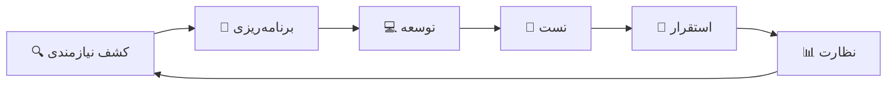

<div align="center">
  <a href="https://dumirror.com/">
    
  </a>
</div>

<br/>
<br/>

<div align="center">
  
  [](https://github.com/Dumirror/.github/blob/main/profile/README.md)
</div>

<div align="center">
  
  # 🚀 دومیرور | استودیوی توسعه نرم‌افزار
  
  ### *مهندسی آینده با نرم‌افزارهای باکارایی بالا*
  
  [](https://dumirror.com)
  [](https://linkedin.com/company/dumirror)
  [](https://github.com/dumirror)
  [](https://t.me/dumirror)
  [](https://instagram.com/dumirror)
  
  [](LICENSE)
  [](https://github.com/dumirror/contribute)
  [](https://dumirror.com)
  [](https://dumirror.com)
  [](https://dumirror.com)
  
  ---
  
  ### 🌟 **ما آینده را مهندسی می‌کنیم** 🌟
  
  > *"ساخت نرم‌افزارهای باکارایی بالا، اتوماسیون هوشمند و محصولات دیجیتال مقیاس‌پذیر که باعث موفقیت کسب‌وکارها می‌شوند"*
  
</div>

---

## 📖 درباره ما

<table>
<tr>
<td width="100%">

**دومیرور** یک استودیوی پیشرو در توسعه نرم‌افزار است که **نرم‌افزارهای باکارایی بالا**، **اتوماسیون هوشمند** و **محصولات دیجیتال مقیاس‌پذیر** را طراحی و پیاده‌سازی می‌کند. ما با ارائه راه‌حل‌های کاملاً سفارشی—هرگز از قالب‌های آماده استفاده نمی‌کنیم—به کسب‌وکارها در نوآوری، رشد و موفقیت کمک می‌کنیم.

تیم مهندسان متخصص ما به **کیفیت کد**، **امنیت** و **تجربه‌ی کاربری بی‌نظیر** علاقه‌مند است. ما تعالی فنی را با تفکر خلاقانه ترکیب می‌کنیم تا راه‌حل‌های دیجیتال قابل اعتماد، مقیاس‌پذیر و آینده‌نگر بسازیم.

</td>
</tr>
</table>

---

## 💡 چه کار می‌کنیم

<div align="center">
  <table>
    <tr>
      <td align="center" width="33%">
        <h3>🌐</h3>
        <h4>توسعه فول‌استک وب</h4>
        <hr>
        <p><small>ما اپلیکیشن‌های وب مدرن، ریسپانسیو و باکارایی بالا را متناسب با نیازهای کسب‌وکار شما می‌سازیم.</small></p>
      </td>
      <td align="center" width="33%">
        <h3>🤖</h3>
        <h4>ربات‌های تلگرام</h4>
        <hr>
        <p><small>ربات‌های تلگرام سفارشی برای اتوماسیون، پشتیبانی مشتری، فروشگاه‌های اینترنتی، اعلان‌ها و موارد بیشتر.</small></p>
      </td>
      <td align="center" width="33%">
        <h3>💡</h3>
        <h4>هر ایده‌ی جذابی که تصور کنید</h4>
        <hr>
        <p><small>ایده‌ی جذابی دارید؟ ما می‌سازیمش! از ابزارهای هوش مصنوعی تا پلتفرم‌های SaaS—هر چیزی که جذاب باشه، ما انجامش می‌دیم.</small></p>
      </td>
    </tr>
  </table>
</div>

---

## 🎯 ماموریت و ارزش‌های ما

<div align="center">
  <table>
    <tr>
      <td align="center" width="33%">
        <h3>🎨</h3>
        <h4>نوآوری</h4>
        <sub>فناوری پیشرو</sub>
        <hr>
        <p><small>ما از جدیدترین فریم‌ورک‌ها، هوش مصنوعی و ابزارهای اتوماسیون برای ساخت راه‌حل‌های آینده‌نگر استفاده می‌کنیم.</small></p>
      </td>
      <td align="center" width="33%">
        <h3>⚡</h3>
        <h4>کیفیت</h4>
        <sub>کد تمیز و بهینه</sub>
        <hr>
        <p><small>هر خط کد با دقت نوشته، به‌طور کامل تست و برای عملکرد اوج بهینه‌سازی می‌شود.</small></p>
      </td>
      <td align="center" width="33%">
        <h3>🚀</h3>
        <h4>مقیاس‌پذیری</h4>
        <sub>ساخته شده برای رشد</sub>
        <hr>
        <p><small>معماری‌های ما به‌گونه‌ای طراحی شده‌اند که با رشد و تکامل کسب‌وکار شما به‌طور یکپارچه مقیاس‌پذیر شوند.</small></p>
      </td>
    </tr>
  </table>
</div>

---

## 🛠️ پشته فناوری

<div align="center">

### 🖥️ توسعه فرانت‌اند


### ⚙️ توسعه بک‌اند و API


### 🤖 هوش مصنوعی


### ☁️ ابر و دواپس


### ⛓️ بلاکچین و وب۳


### 🗄️ مهندسی دیتابیس


</div>

---

## 🔄 فرآیند توسعه

<div align="center">
  


</div>

### چرخه توسعه ۵ مرحله‌ای ما

<table>
<tr>
<td width="20%" align="center">
  <h2>🔍</h2>
  <h4>کشف نیازمندی</h4>
  <hr>
  <p><small>تحلیل عمیق کسب‌وکار و جمع‌آوری نیازمندی‌ها</small></p>
  <ul align="right">
    <li><small>مصاحبه با ذی‌نفعان</small></li>
    <li><small>تحلیل رقبا</small></li>
    <li><small>مطالعه امکان‌سنجی فنی</small></li>
  </ul>
</td>
<td width="20%" align="center">
  <h2>📝</h2>
  <h4>برنامه‌ریزی</h4>
  <hr>
  <p><small>طراحی معماری و نقشه‌راه پروژه</small></p>
  <ul align="right">
    <li><small>معماری سیستم</small></li>
    <li><small>طراحی دیتابیس</small></li>
    <li><small>نمونه‌سازی UI/UX</small></li>
  </ul>
</td>
<td width="20%" align="center">
  <h2>💻</h2>
  <h4>توسعه</h4>
  <hr>
  <p><small>اسپرینت‌های چابک با تحویل مداوم</small></p>
  <ul align="right">
    <li><small>اسپرینت‌های ۲ هفته‌ای</small></li>
    <li><small>جلسات روزانه</small></li>
    <li><small>بازبینی کد</small></li>
  </ul>
</td>
<td width="20%" align="center">
  <h2>🧪</h2>
  <h4>تست</h4>
  <hr>
  <p><small>تضمین کیفیت جامع و ممیزی امنیتی</small></p>
  <ul align="right">
    <li><small>تست‌های واحد و یکپارچه</small></li>
    <li><small>تست عملکرد</small></li>
    <li><small>ارزیابی امنیتی</small></li>
  </ul>
</td>
<td width="20%" align="center">
  <h2>🚀</h2>
  <h4>استقرار</h4>
  <hr>
  <p><small>استقرار در محیط تولید و نظارت</small></p>
  <ul align="right">
    <li><small>خط لوله CI/CD</small></li>
    <li><small>راه‌اندازی زیرساخت</small></li>
    <li><small>نظارت ۲۴/۷</small></li>
  </ul>
</td>
</tr>
</table>

---

## ✨ چرا دومیرور؟

<div align="center">
  <table>
    <tr>
      <td width="50%">
        <h3>✅ توسعه ۱۰۰٪ سفارشی</h3>
        <p>هر پروژه از صفر بر اساس نیازمندی‌های خاص کسب‌وکار شما ساخته می‌شود—هرگز از قالب‌های آماده استفاده نمی‌شود.</p>
        <p><i>🛠️ راه‌حل‌های متناسب برای چالش‌های منحصربه‌فرد</i></p>
      </td>
      <td width="50%">
        <h3>✅ معماری مقیاس‌پذیر</h3>
        <p>سیستم‌هایی طراحی شده‌اند که با کسب‌وکار شما رشد کنند و بارهای افزایشی و درخواست‌های کاربران را به‌راحتی مدیریت کنند.</p>
        <p><i>📈 زیرساخت آینده‌نگر</i></p>
      </td>
    </tr>
    <tr>
      <td width="50%">
        <h3>✅ شفافیت کامل</h3>
        <p>برآورد هزینه‌ی دقیق، زمان‌بندی مشخص، گزارش‌های منظم از پیشرفت و ارتباط باز در طول پروژه.</p>
        <p><i>🔍 بدون هزینه‌ی پنهان یا غافلگیری</i></p>
      </td>
      <td width="50%">
        <h3>✅ تیم مهندسی متخصص</h3>
        <p>مهندسان با تجربه متخصص در فناوری‌های مدرن، بهترین شیوه‌ها و متدولوژی‌های چابک.</p>
        <p><i>👨‍💻 استعدادهای برتر فنی</i></p>
      </td>
    </tr>
    <tr>
      <td width="50%">
        <h3>✅ راه‌حل‌های مبتنی بر هوش مصنوعی</h3>
        <p>یکپارچه‌سازی اتوماسیون هوشمند و یادگیری ماشین برای بهینه‌سازی فرآیندها و تصمیم‌گیری.</p>
        <p><i>🤖 اتوماسیون هوشمند در مقیاس</i></p>
      </td>
      <td width="50%">
        <h3>✅ پشتیبانی بلندمدت</h3>
        <p>نگهداری مداوم، به‌روزرسانی‌ها و پشتیبانی فنی برای اطمینان از اینکه محصول شما همیشه پیشرو باشد.</p>
        <p><i>🛡️ تیم پشتیبانی اختصاصی</i></p>
      </td>
    </tr>
  </table>
</div>

---

## 📊 به عدد

<div align="center">
  <table>
    <tr>
      <td align="center" width="25%">
        <h1>🔷</h1>
        <h2>۱۵۰+</h2>
        <sub>پروژه تحویل داده شده</sub>
        <p><i>🌟 با موفقیت انجام شده</i></p>
      </td>
      <td align="center" width="25%">
        <h1>🔷</h1>
        <h2>۹۸%</h2>
        <sub>رضایت مشتری</sub>
        <p><i>😊 مشتریان راضی در سراسر جهان</i></p>
      </td>
      <td align="center" width="25%">
        <h1>🔷</h1>
        <h2>۵۰+</h2>
        <sub>مهندس متخصص</sub>
        <p><i>👨‍💻 تیم در حال رشد از متخصصان</i></p>
      </td>
      <td align="center" width="25%">
        <h1>🔷</h1>
        <h2>۴.۹⭐</h2>
        <sub>امتیاز مشتریان</sub>
        <p><i>⭐ نظرات عالی</i></p>
      </td>
    </tr>
  </table>
</div>

---

## 🏆 پروژه‌های شاخص

| پروژه | توضیحات | فناوری‌ها | تاثیر |
|---------|-------------|--------------|--------|
| 🏥 **سیستم مدیریت بیمارستان هوشمند** | سیستم جامع مدیریت بیمارستان با برنامه‌ریزی مبتنی بر هوش مصنوعی | Django, React, TensorFlow | 📈 افزایش ۴۰٪ کارایی |
| 🛒 **پلتفرم فروشگاهی هوش مصنوعی** | فروشگاه اینترنتی هوشمند با موتور توصیه‌گر و پشتیبانی چت | Next.js, Node.js, OpenAI | 📈 افزایش ۶۵٪ تبدیل |
| 📊 **داشبورد تحلیلی** | ابزار تجسم داده‌ها و گزارش‌گیری لحظه‌ای | Python, GraphQL, D3.js | 📈 تصمیم‌گیری ۸۰٪ سریع‌تر |
| 🤖 **مجموعه اتوماسیون کسب‌وکار** | راه‌حل‌های اتوماسیون فرآیندهای کسب‌وکار | Python, LangChain, Docker | 📈 کاهش ۷۰٪ هزینه |
| 🏦 **پلتفرم فین‌تک** | سیستم پرداخت امن و تشخیص تقلب | Go, React, PostgreSQL | 📈 تراکنش‌های ۱۰+ میلیون دلاری |
| 🎓 **راه‌حل آموزشی** | پلتفرم آموزش تعاملی با تدریس خصوصی مبتنی بر هوش مصنوعی | Vue.js, Node.js, PyTorch | 📈 ۵۰+ هزار کاربر فعال |

---

## 🤝 با ما همکاری کنید

<div align="center">
  
### 💼 برای مشتریان
[](https://dumirror.com/#contact)
[](https://dumirror.com/portfolio)
[](https://dumirror.com/quote)

### 👨‍💻 برای متقاضیان کار
[](https://dumirror.com/careers)
[](https://dumirror.com/blog)
[](https://dumirror.com/jobs)

</div>

---

## 📦 خدماتی که ارائه می‌دهیم

<div align="center">
  <table>
    <tr>
      <td align="center" width="33%">
        <h3>💻</h3>
        <h4>توسعه نرم‌افزار سفارشی</h4>
        <sub>راه‌حل‌های کامل متناسب با نیازهای شما</sub>
      </td>
      <td align="center" width="33%">
        <h3>🤖</h3>
        <h4>هوش مصنوعی و اتوماسیون هوشمند</h4>
        <sub>یادگیری ماشین، پردازش زبان طبیعی و راه‌حل‌های RPA</sub>
      </td>
      <td align="center" width="33%">
        <h3>📱</h3>
        <h4>توسعه اپلیکیشن موبایل</h4>
        <sub>اپلیکیشن‌های iOS، اندروید و چندسکویی</sub>
      </td>
    </tr>
    <tr>
      <td align="center" width="33%">
        <h3>🖥️</h3>
        <h4>توسعه وب</h4>
        <sub>وب‌سایت‌های مدرن، ریسپانسیو و باکارایی بالا</sub>
      </td>
      <td align="center" width="33%">
        <h3>☁️</h3>
        <h4>راه‌حل‌های ابری</h4>
        <sub>معماری و مهاجرت به AWS، Azure، GCP</sub>
      </td>
      <td align="center" width="33%">
        <h3>📊</h3>
        <h4>تحلیل داده و هوش تجاری</h4>
        <sub>داشبورد، گزارش‌گیری و بینش داده</sub>
      </td>
    </tr>
  </table>
</div>

---

## 📞 ارتباط با ما

<div align="center">
  <table>
    <tr>
      <td align="center">
        <h3>🌐</h3>
        <a href="https://dumirror.com"><b>dumirror.com</b></a>
        <br>
        <small>بازدید از وب‌سایت</small>
      </td>
      <td align="center">
        <h3>📧</h3>
        <a href="mailto:dumirror.dev@gmail.com"><b>dumirror.dev@gmail.com</b></a>
        <br>
        <small>هر زمان ایمیل بزنید</small>
      </td>
    </tr>
  </table>
</div>

---

## 📄 مجوز

<div align="center">
  
```
© ۲۰۲۶ دومیرور. تمامی حقوق محفوظ است.

این نرم‌افزار و کدهای منبع آن اختصاصی و محرمانه هستند.
کپی‌برداری، توزیع یا استفاده‌ی تجاری بدون
مجوز کتبی از دومیرور اکیداً ممنوع می‌باشد.

برای سوالات مربوط به مجوز، تماس بگیرید: dumirror.dev@gmail.com
```

[](LICENSE)
[](https://dumirror.com/security)

</div>

---

## 🌟 پشتیبانی و جامعه

<div align="center">

[](https://discord.gg/dumirror)
[](https://stackoverflow.com/companies/dumirror)
[](https://medium.com/@dumirror)
[](https://dev.to/dumirror)

</div>

---

<div align="center">
  
### ⭐ حمایت خود را نشان دهید! ⭐

اگر کار ما را ارزشمند می‌دانید، لطفاً به ما در گیت‌هاب ستاره دهید!

[](https://github.com/dumirror)

---

### 🏢 دومیرور — مهندسی آینده، یک راه‌حل سفارشی در هر بار.

**ساخته شده با ❤️ توسط تیم دومیرور**

</div>
