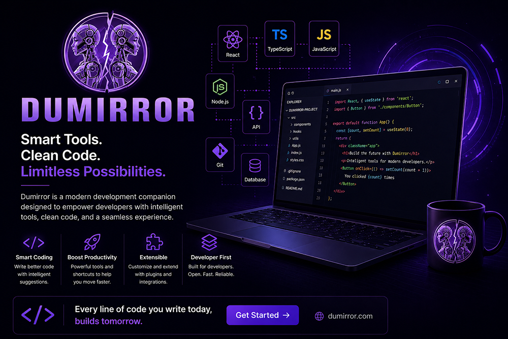
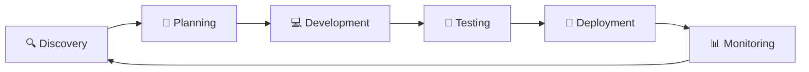

<div align="center">
  <a href="https://dumirror.com/">
    
  </a>
</div>

<br/>
<br/>

<div align="center">
  
  [](https://github.com/Dumirror/.github/blob/main/profile/README-fa.md)
</div>
<div align="center">
  
  # 🚀 Dumirror | Software Development Studio
  
  ### *Engineering the Future with High-Performance Software*
  
<p align="center">
  <strong>Dumirror</strong><br>
  <em>Engineering the Future with High-Performance Software</em>
</p>

<p align="center">
  <a href="https://dumirror.com"></a>
  <a href="https://linkedin.com/company/dumirror"></a>
  <a href="https://github.com/dumirror"></a>
  <a href="https://t.me/dumirror"></a>
  <a href="https://instagram.com/dumirror"></a>
</p>r)
  
  [](LICENSE)
  [](https://github.com/dumirror/contribute)
  [](https://dumirror.com)
  [](https://dumirror.com)
  [](https://dumirror.com)
  
  ---
  
  ### 🌟 **We Engineer the Future** 🌟
  
  > *"Building high-performance software, intelligent automation, and scalable digital products that drive business success"*
  
</div>

---

## 📖 About Us

<table>
<tr>
<td width="100%">

**Dumirror** is a forward-thinking software development studio that designs and builds **high-performance software**, **intelligent automation**, and **scalable digital products**. We help businesses innovate, grow, and succeed by delivering tailor-made solutions—never off-the-shelf templates.

Our team of expert engineers is passionate about **code quality**, **security**, and **exceptional user experiences**. We combine technical excellence with creative thinking to build reliable, scalable, and future-ready digital solutions.

</td>
</tr>
</table>

---

## 💡 What We Do

<div align="center">
  <table>
    <tr>
      <td align="center" width="33%">
        <h3>🌐</h3>
        <h4>Full-Stack Web Development</h4>
        <hr>
        <p><small>We build modern, responsive, and high-performance full-stack web applications tailored to your business needs.</small></p>
      </td>
      <td align="center" width="33%">
        <h3>🤖</h3>
        <h4>Telegram Bots</h4>
        <hr>
        <p><small>Custom Telegram bots for automation, customer support, e-commerce, notifications, and more.</small></p>
      </td>
      <td align="center" width="33%">
        <h3>💡</h3>
        <h4>Anything Awesome You Imagine</h4>
        <hr>
        <p><small>Got a cool idea? We build it! From AI tools to SaaS platforms—if it's awesome, we make it happen.</small></p>
      </td>
    </tr>
  </table>
</div>

---

## 🎯 Our Mission & Values

<div align="center">
  <table>
    <tr>
      <td align="center" width="33%">
        <h3>🎨</h3>
        <h4>Innovation</h4>
        <sub>Cutting-edge technology</sub>
        <hr>
        <p><small>We leverage the latest frameworks, AI, and automation tools to build future-proof solutions.</small></p>
      </td>
      <td align="center" width="33%">
        <h3>⚡</h3>
        <h4>Quality</h4>
        <sub>Clean & optimized code</sub>
        <hr>
        <p><small>Every line of code is written with precision, thoroughly tested, and optimized for peak performance.</small></p>
      </td>
      <td align="center" width="33%">
        <h3>🚀</h3>
        <h4>Scalability</h4>
        <sub>Built for growth</sub>
        <hr>
        <p><small>Our architectures are designed to scale seamlessly as your business grows and evolves.</small></p>
      </td>
    </tr>
  </table>
</div>

---

## 🛠️ Technology Stack

<div align="center">

### 🖥️ Frontend Development


### ⚙️ Backend & API Development


### 🤖 Artificial Intelligence


### ☁️ Cloud & DevOps


### ⛓️ Blockchain & Web3


### 🗄️ Database Engineering


</div>

---

## 🔄 Development Process

<div align="center">
  


</div>

### Our 5-Step Development Lifecycle

<table>
<tr>
<td width="20%" align="center">
  <h2>🔍</h2>
  <h4>Discovery</h4>
  <hr>
  <p><small>In-depth business analysis and requirement gathering</small></p>
  <ul align="left">
    <li><small>Stakeholder interviews</small></li>
    <li><small>Competitor analysis</small></li>
    <li><small>Technical feasibility study</small></li>
  </ul>
</td>
<td width="20%" align="center">
  <h2>📝</h2>
  <h4>Planning</h4>
  <hr>
  <p><small>Architecture design and project roadmap</small></p>
  <ul align="left">
    <li><small>System architecture</small></li>
    <li><small>Database design</small></li>
    <li><small>UI/UX prototyping</small></li>
  </ul>
</td>
<td width="20%" align="center">
  <h2>💻</h2>
  <h4>Development</h4>
  <hr>
  <p><small>Agile sprints with continuous delivery</small></p>
  <ul align="left">
    <li><small>2-week sprints</small></li>
    <li><small>Daily standups</small></li>
    <li><small>Code reviews</small></li>
  </ul>
</td>
<td width="20%" align="center">
  <h2>🧪</h2>
  <h4>Testing</h4>
  <hr>
  <p><small>Comprehensive QA and security audits</small></p>
  <ul align="left">
    <li><small>Unit & integration tests</small></li>
    <li><small>Performance testing</small></li>
    <li><small>Security assessment</small></li>
  </ul>
</td>
<td width="20%" align="center">
  <h2>🚀</h2>
  <h4>Deployment</h4>
  <hr>
  <p><small>Production deployment and monitoring</small></p>
  <ul align="left">
    <li><small>CI/CD pipeline</small></li>
    <li><small>Infrastructure setup</small></li>
    <li><small>24/7 monitoring</small></li>
  </ul>
</td>
</tr>
</table>

---

## ✨ Why Choose Dumirror?

<div align="center">
  <table>
    <tr>
      <td width="50%">
        <h3>✅ 100% Custom Development</h3>
        <p>Every project is built from scratch based on your specific business requirements—never from pre-built templates.</p>
        <p><i>🛠️ Tailored solutions for unique challenges</i></p>
      </td>
      <td width="50%">
        <h3>✅ Scalable Architecture</h3>
        <p>Systems designed to grow with your business, handling increasing loads and user demands effortlessly.</p>
        <p><i>📈 Future-proof infrastructure</i></p>
      </td>
    </tr>
    <tr>
      <td width="50%">
        <h3>✅ Full Transparency</h3>
        <p>Clear cost estimates, defined timelines, regular progress updates, and open communication throughout.</p>
        <p><i>🔍 No hidden fees or surprises</i></p>
      </td>
      <td width="50%">
        <h3>✅ Expert Engineering Team</h3>
        <p>Experienced engineers specializing in modern technologies, best practices, and agile methodologies.</p>
        <p><i>👨‍💻 Top-tier tech talent</i></p>
      </td>
    </tr>
    <tr>
      <td width="50%">
        <h3>✅ AI-Powered Solutions</h3>
        <p>Integration of intelligent automation and machine learning to optimize processes and decision-making.</p>
        <p><i>🤖 Smart automation at scale</i></p>
      </td>
      <td width="50%">
        <h3>✅ Long-Term Support</h3>
        <p>Ongoing maintenance, updates, and technical support to ensure your product remains cutting-edge.</p>
        <p><i>🛡️ Dedicated support team</i></p>
      </td>
    </tr>
  </table>
</div>

---

## 📊 By the Numbers

<div align="center">
  <table>
    <tr>
      <td align="center" width="25%">
        <h1>🔷</h1>
        <h2>150+</h2>
        <sub>Projects Delivered</sub>
        <p><i>🌟 Successfully completed</i></p>
      </td>
      <td align="center" width="25%">
        <h1>🔷</h1>
        <h2>98%</h2>
        <sub>Client Satisfaction</sub>
        <p><i>😊 Happy clients worldwide</i></p>
      </td>
      <td align="center" width="25%">
        <h1>🔷</h1>
        <h2>50+</h2>
        <sub>Expert Engineers</sub>
        <p><i>👨‍💻 Growing team of specialists</i></p>
      </td>
      <td align="center" width="25%">
        <h1>🔷</h1>
        <h2>4.9⭐</h2>
        <sub>Client Rating</sub>
        <p><i>⭐ Outstanding reviews</i></p>
      </td>
    </tr>
  </table>
</div>

---

## 🏆 Featured Projects

| Project | Description | Technologies | Impact |
|---------|-------------|--------------|--------|
| 🏥 **Smart Hospital Management** | Comprehensive hospital management system with AI-powered scheduling | Django, React, TensorFlow | 📈 40% efficiency increase |
| 🛒 **AI E-Commerce Platform** | Intelligent e-commerce with recommendation engine and chat support | Next.js, Node.js, OpenAI | 📈 65% conversion boost |
| 📊 **Analytics Dashboard** | Real-time data visualization and reporting tool | Python, GraphQL, D3.js | 📈 80% faster decisions |
| 🤖 **Business Automation Suite** | RPA and workflow automation solutions | Python, LangChain, Docker | 📈 70% cost reduction |
| 🏦 **FinTech Platform** | Secure payment processing and fraud detection system | Go, React, PostgreSQL | 📈 $10M+ transactions |
| 🎓 **EdTech Solution** | Interactive learning platform with AI-powered tutoring | Vue.js, Node.js, PyTorch | 📈 50k+ active users |

---

## 🤝 Work With Us

<div align="center">
  
### 💼 For Clients
[](https://dumirror.com/#contact)
[](https://dumirror.com/portfolio)
[](https://dumirror.com/quote)

### 👨‍💻 For Job Seekers
[](https://dumirror.com/careers)
[](https://dumirror.com/blog)
[](https://dumirror.com/jobs)

</div>

---

## 📦 Services We Offer

<div align="center">
  <table>
    <tr>
      <td align="center" width="33%">
        <h3>💻</h3>
        <h4>Custom Software Development</h4>
        <sub>End-to-end solutions tailored to your needs</sub>
      </td>
      <td align="center" width="33%">
        <h3>🤖</h3>
        <h4>AI & Intelligent Automation</h4>
        <sub>Machine learning, NLP, and RPA solutions</sub>
      </td>
      <td align="center" width="33%">
        <h3>📱</h3>
        <h4>Mobile App Development</h4>
        <sub>iOS, Android, and cross-platform apps</sub>
      </td>
    </tr>
    <tr>
      <td align="center" width="33%">
        <h3>🖥️</h3>
        <h4>Web Development</h4>
        <sub>Modern, responsive, and performant websites</sub>
      </td>
      <td align="center" width="33%">
        <h3>☁️</h3>
        <h4>Cloud Solutions</h4>
        <sub>AWS, Azure, GCP architecture and migration</sub>
      </td>
      <td align="center" width="33%">
        <h3>📊</h3>
        <h4>Data Analytics & BI</h4>
        <sub>Dashboard, reporting, and data insights</sub>
      </td>
    </tr>
  </table>
</div>

---

## 📞 Contact Us

<div align="center">
  <table>
    <tr>
      <td align="center">
        <h3>🌐</h3>
        <a href="https://dumirror.com"><b>dumirror.com</b></a>
        <br>
        <small>Visit our website</small>
      </td>
      <td align="center">
        <h3>📧</h3>
        <a href="mailto:dumirror.dev@gmail.com"><b>dumirror.dev@gmail.com</b></a>
        <br>
        <small>Email us anytime</small>
      </td>
    </tr>
  </table>
</div>

---

## 📄 License

<div align="center">
  
```
© 2026 Dumirror. All Rights Reserved.

This software and its source code are proprietary and confidential.
Unauthorized copying, distribution, or commercial use is strictly
prohibited without prior written consent from Dumirror.

For licensing inquiries, please contact: dumirror.dev@gmail.com
```

[](LICENSE)
[](https://dumirror.com/security)

</div>

---

## 🌟 Support & Community

<div align="center">

[](https://discord.gg/dumirror)
[](https://stackoverflow.com/companies/dumirror)
[](https://medium.com/@dumirror)
[](https://dev.to/dumirror)

</div>

---

<div align="center">
  
### ⭐ Show Your Support! ⭐

If you find our work valuable, please consider giving us a star on GitHub!

[](https://github.com/dumirror)

---

### 🏢 Dumirror — Engineering the Future, One Custom Solution at a Time.

**Built with ❤️ by the Dumirror Team**

</div>
